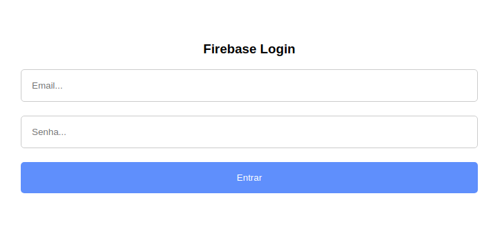
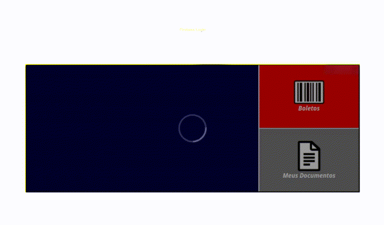

<h1 align="center">Firebase Login</h1>

Projeto desenvolvido por Luciano de Carvalho para gestão de Documentos.
 
<ul>
<li><b>Boletos</b> - documentos enviados pela empresa ao funcionário.</li>
<li><b>Documentos</b> - seriam envios do funcionário para a Empresa.</li>
</ul>

<h2 align="center">Screenshots</h2>

  
  
  

<a href='./index.html'>Ir para Código</a>

